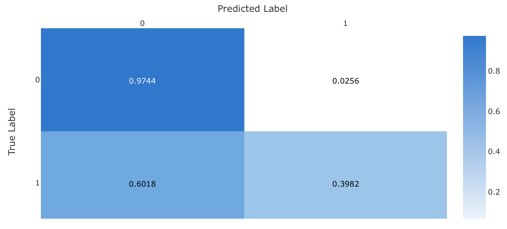

# Optimizing an ML Pipeline in Azure

## Overview
This project is part of the Udacity Azure ML Nanodegree.
In this project, we build and optimize an Azure ML pipeline using the Python SDK and a provided Scikit-learn model.
This model is then compared to an Azure AutoML run.

## Summary
**In 1-2 sentences, explain the problem statement: e.g "This dataset contains data about... we seek to predict..."**

In this project we use the `UCI Bank Marketing` dataset, which contains financial and personal data about bank's customers. 
The goal of the classification task is to predict if the client will subscribe to a term deposit with the bank.

**In 1-2 sentences, explain the solution: e.g. "The best performing model was a ..."**

The best performing model was a `VotingEnsemble` method found via AutoML. 
The Ensemble consist of two models, namely `XGBoostClassifier` and `SGDClassifier` 

## Scikit-learn Pipeline
**Explain the pipeline architecture, including data, hyperparameter tuning, and classification algorithm.**

The pipeline works as follow:
* The dataset is retrieved and some preprocessing is carried out, i.e. one-hot encoding and binary encoding of categorical features and parsing of date fields
* The clean data is divided into two sets, one for training and one for testing, with a ratio of 0.7/0.3
* A `LogisticRegression` model is instantiated using two arguments — *C* and *max_iter* — which are sampled randomly from the parameter space
* An HyperDrive run is executed with the goal of maximizing accuracy

**What are the benefits of the parameter sampler you chose?**

We use RandomParameterSampling because we can greatly reduce computation costs and speedup up the exploration of the parameter space. 
Given the low dimensionality of the UCI Bank Marketing dataset, and the small number of hyperparameter to tune random sampling is a better choice w.r.t. GridSearch. 

**What are the benefits of the early stopping policy you chose?**

The benefit of `BanditPolicy` is that it allows us to define a minimum required improvement in order to continu with the parameter search.
Since we are maximizing accuracy we can define a stopping condition on the slack of the best accuracy to avoid wasting computation and time.

## AutoML
**In 1-2 sentences, describe the model and hyperparameters generated by AutoML.**

The best model generated by AutoML is a `VotingEnsemble` method with a pre-processing step that uses. 
The Ensemble consist of two models, namely `XGBoostClassifier` and `SGDClassifier`, which use a `StandardScaler` and `MaxAbsScaler` as pre-processing step, respectively. Other models are shown in the image below 

## Pipeline comparison
**Compare the two models and their performance. What are the differences in accuracy? In architecture? If there was a difference, why do you think there was one?**

The two best models found by HyperDrive and AutoML have reported an accuracy of `0.9103` and `0.9179`. The difference in accuracy is very small, and could be due to the different size of the test set. Nonetheless, the two models have a huge difference in their complexity. As shown in the next point the high accuracy of both model is due to class imbalance and hence a weighted approach would be more suitable for this project.

## Future work
**What are some areas of improvement for future experiments? Why might these improvements help the model?**

An important problem that needs to be tackled to improve this project is class imbalance. 
This problem is also higlighted by AutoML as shown in this image 
In fact, if we look at the confusion matrices of the best models for AutoML and HyperDrive we find that both tend to wrongly classify ponential subscribers.

Voting Ensemble                         |  Logistic Regression
:--------------------------------------:|:--------------------------------------:
 | 
